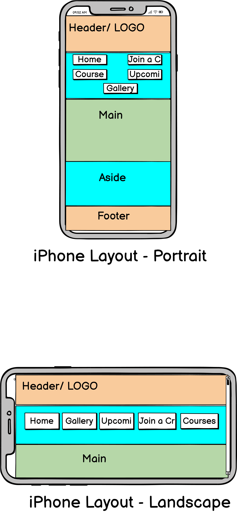

## Submission readme.md file
Github-pages: URL:
    https://aruttle.github.io/aruttle-assignment1-github.io/

Github-repo: URL:
    https://github.com/aruttle/aruttle-assignment1-github.io

## Site Map

---
[Link to view the image](./docs/sitemap.png)

### Site Map Address 
    https://aruttle.github.io/aruttle-assignment1-github.io/
    https://aruttle.github.io/aruttle-assignment1-github.io/index.html
    https://aruttle.github.io/aruttle-assignment1-github.io/gallery.html
    https://aruttle.github.io/aruttle-assignment1-github.io/join-a-crew.html
    https://aruttle.github.io/aruttle-assignment1-github.io/upcoming-events.html
    https://aruttle.github.io/aruttle-assignment1-github.io/courses.html

### Site Map XML
    <?xml version="1.0" encoding="UTF-8"?>
    <urlset
        xmlns="http://www.sitemaps.org/schemas/sitemap/0.9"
        xmlns:xsi="http://www.w3.org/2001/XMLSchema-instance"
        xsi:schemaLocation="http://www.sitemaps.org/schemas/sitemap/0.9
                http://www.sitemaps.org/schemas/sitemap/0.9/sitemap.xsd">
    <!-- created with Free Online Sitemap Generator www.xml-sitemaps.com -->

    <url>
    <loc>https://aruttle.github.io/aruttle-assignment1-github.io/</loc>
    <lastmod>2024-11-23T00:07:32+00:00</lastmod>
    <priority>1.00</priority>
    </url>
    <url>
    <loc>https://aruttle.github.io/aruttle-assignment1-github.io/index.html</loc>
    <lastmod>2024-11-23T00:07:32+00:00</lastmod>
    <priority>0.80</priority>
    </url>
    <url>
    <loc>https://aruttle.github.io/aruttle-assignment1-github.io/join-a-crew.html</loc>
    <lastmod>2024-11-23T00:07:32+00:00</lastmod>
    <priority>0.80</priority>
    </url>
    <url>
    <loc>https://aruttle.github.io/aruttle-assignment1-github.io/courses.html</loc>
    <lastmod>2024-11-23T00:07:32+00:00</lastmod>
    <priority>0.80</priority>
    </url>
    <url>
    <loc>https://aruttle.github.io/aruttle-assignment1-github.io/upcoming-events.html</loc>
    <lastmod>2024-11-23T00:07:32+00:00</lastmod>
    <priority>0.80</priority>
    </url>
    <url>
    <loc>https://aruttle.github.io/aruttle-assignment1-github.io/gallery.html</loc>
    <lastmod>2024-11-23T00:07:32+00:00</lastmod>
    <priority>0.80</priority>
    </url>

</urlset>

## Wireframes
Click [here](./docs/wireframes.pdf)

[Link to view the image](./docs/iphone-wireframe.png)

[Link to view the image](./docs/ipad-wireframe.png)

[Link to view the image](./docs/monitor-wireframe.png)

## Planning Analysis Sheet
### Website goal
    To create website based on the sport sailing and white sails racing. I want to design the site around encouraging people to have a go at sailing by providing different ways and opportunities to do so on the site. 

## List the working title of each page on your site.
### Home
    This will have some info about the site. I also want to add a weather and tide widget to this page as this is what is usually looked at first on a sailing site. There will also be a video of a race event. Gride layout with 3 columns and 3 rows but may add more rows if needed. There should also be a 'mailto' link in the welcome note for more info.
    
### Join a Crew 
    There will be a motivational message here to hook potential crew. There will also be a form that interested parties can fill out to be matched with a suitable crew.

### Courses
    This page will have a table with some sailing courses. The last column should have external links for more information. The links also should use transforms.

### Upcoming Events
    The page has another table with upcoming sailing events and races.

### Gallery
    The site has a Gallery page using a grid display. Images transform scale when pointer hovers over. 

## List of sources
### Images
    Three images are from Kling AI 
    https://klingai.com/
    
    All other images are my own.
### Video 
    The video used is from WIORA (West of Ireland Offshore Racing Association) 2019 and can be found on YouTube: https://www.youtube.com/watch?v=IkElwdcv3yc

### Widgets
    The weather widget used is from weatherwidget.org: https://weatherwidget.org
    The tide widget used is from Tide Times: https://www.tidetimes.org.uk

### Logo
    The logo was created in PowerPoint.

## SEO Features
    I used meta-keywords and sitemap.xml

[Link to view the image](./docs/meta-keywords.png)

## Accessibility
   To check the accessability of the site I used a combination of Lighthouse and  Silktide.

[Link to view the image](./docs/lighthouse.png)

[Link to view the image](./docs/silktide.png)

## Site Features 
- Responsive at max-width: 1024px and max-width: 768px.
- Works in browsers Chrome, Edge and Firefox.
- The colour palette used for the visual design was in keeping with the background image sunset.
- The Navigation bar is consistent across all pages.
- The Banner is also consistent across all pages.
- Site has a Home Page and four content pages.
- Meta Tags used as outlined above.
- The site has 2 table pages.
- Home page has an email hyper link.
- External links included in the last column of the table in Courses page.
- YouTube video embedded on home page.
- CSS image Gallery page with hover-over transitions.
- CSS Transition also added to hyperlinks and nav buttons.

